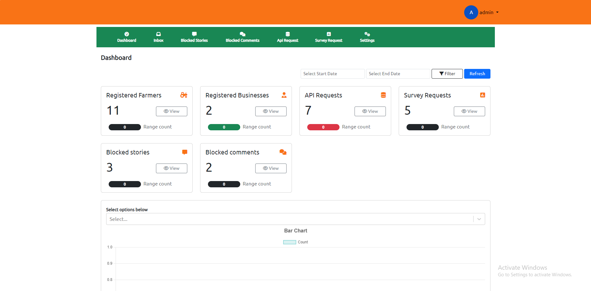

# E-Platform Website

A Website made with React.js Framework.


## Features

- Easy to integrate with Backend bulit using Node Express.
- Fully Responsive


## Screenshots




## Run Locally

Clone the project

```bash
  git clone https://github.com/.git
```

Go to the project directory

```bash
  cd farmer360-frontend
```

Install dependencies

```bash
  npm install
```

Start the server

```bash
  npm start
```


## Tech Stack

* [React](https://reactjs.org/)
* [Redux](https://redux.js.org/)
* [Bootstrap](https://getbootstrap.com/)
* [Firebase] (https://firebase.google.com/)
* [Fake Store API](https://fakestoreapi.com/)

